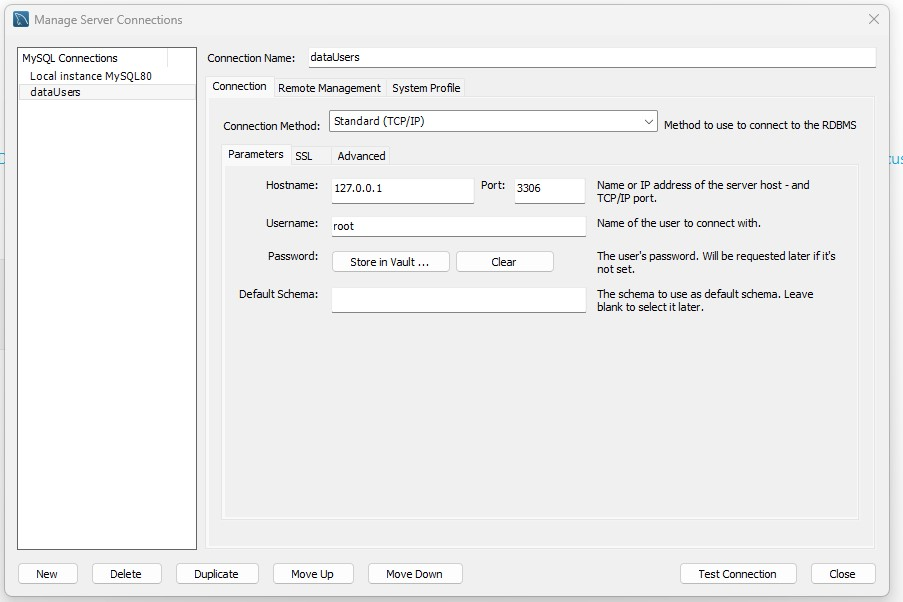
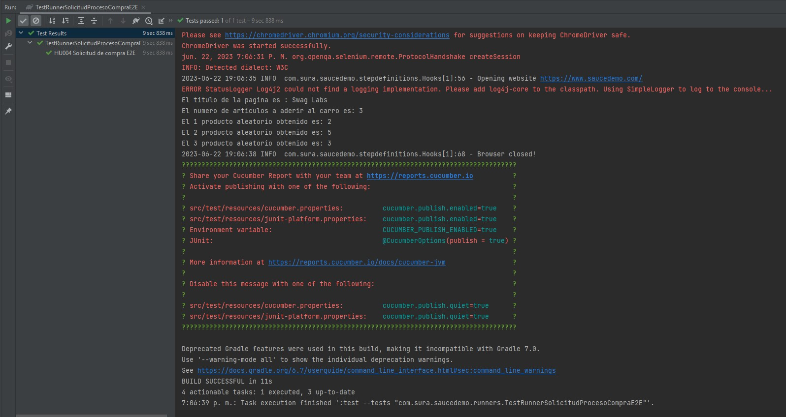

**Reto tecnico automatizado**

Proyecto de pruebas funcionales automatizadas bajo el patón POM, desarrolladas en en IDE IntelliJ en lenguaje Java.

El ID del ejercicio asignado es **PFA_01_QAN**

El nombre de la rama donde está la automatización es **master**

**Documentacion oficial**

Guia Oficial cucumber

https://cucumber.io/docs/cucumber/

Uso de version 2.1.2 con Cucumber4

Gradle

https://docs.gradle.org/current/userguide/userguide.html

Uso de version 6.7

Windows

Se uso de version 11 de Windows x64 bits

Google Chrome

Se uso la versión 114.0.5735.134 (Build oficial) (64 bits)

ChromeDriver 

Se uso la versión  114.0.5735.90

Java

Uso de version 11

**Ejecucion de la prueba automatizada**

Para poder realizar la ejecucion de la prueba se debe tener en cuenta una conexion a una base de datos local de MySQL cuya configuracion basica se muestra a continuación, el script se encuentra dentro del archivo "BD dataUsers.sql".

 

Para realizar la ejecución de la prueba utilice el siguiente comando.

        ./gradlew clean test --info

A continuación se evidencia la imagen de la ejecución de la prueba automatización de escenario E2E.

 

